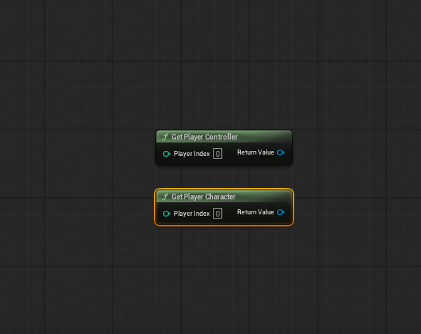
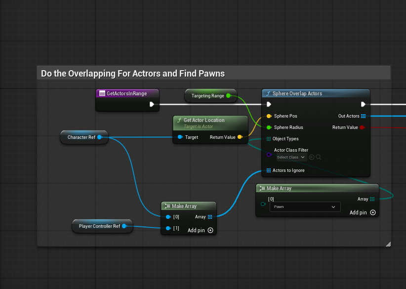

# Unreal Engine Gameplay Systems
##  Chapters :
1. [Few Words About Me](#few-words-about-me)
   -  [Few Things About this Document](#few-things-about-this-document) 
2. [Targeting System](#targeting-system)
   - [Blueprint Approach](#blueprint-approach)
      - [Event Begin Play](#event-begin-play-blueprints)  
      - [GetActorsInRange](#get-actors-in-range-function)

#### Few Words About Me
---
    
Hello, my name is Charalampos and i am currently trying to transition from an Accounting and Finance backround, to create and design Gameplay Systems in Unreal Engine.

I’m not a professional programmer yet, but I understand basic **C++** and **Blueprint** scripting. I’m extremely curious and enjoy researching and building systems from scratch. I am currently document myself making several systems inside Unreal Engine here:

:point_right:  <https://www.youtube.com/@IsHeReally98> (ignore the poor quality :disappointed:). 

For now i've made some videos about :

 - Targeting System,
 - Input System 
 - Drop/Loot System (My own version & With Unreal Engine
Asset Manager) 
 - Inventory System 
 - Equipment
 - GAS 
 
 
I plan to document those systems as well, as much as i can, but my current goal is to learn not only how **Blueprints** interact with each other and **C++** but how can i optimize them as much as i can.

Anyways the point, of this document, or rather the theme of this document will be the **Targeting System**, since this was my first project as well.

#### Few Things About This Document
--- 
When I first started learning Unreal Engine, I relied heavily on courses and tutorials and fell into what many call *tutorial hell*. 

Over the last few months I decided to break away from copying and instead build my own systems. The targeting system here allows the player to cycle through targets by pressing a key. The implementation is presented in three stages:

- Blueprint-only approach 
- Hybrid Blueprint + C++ 
- Full C++ implementation 

The goal is to understand the logic, not just reproduce results. 
  
#### Targeting System 
--- 
What is a targeting system? 

 Different genres approach targeting differently. A turn-based game, for example, selects a target directly through UI interaction, so there’s no need for runtime cycling or scanning.
 

 
 In real-time single-player or multiplayer games, however, the system must continuously compute valid targets around the player. That is where targeting logic becomes essential.
 

 
 And since my own project, are based on this type of genre this <b>Targeting System</b> will be based on cycling, sorted by <b>Distance, Sight</b> and <b>Enemy Types</b>. 

 

## Blueprint Approach
--- 

My first ever video, of me documenting myself was based on a <b>Targeting System</b> that the Player could use, to cycle through different enemies. For example, i wanted the player to be able to target an Enemy, mostly an AI since this project focuses on single player perspective, and no matter the number of enemies in the scene, could cycle through and be sorted by <b>Distance, Sight</b> and <b>Enemy Types</b>. I actually managed to do that but now that i look back on how the project is, i feel like it's not only unoptimazed but the scenario to be able to target a ''large'' amount of Enemies is not ideal. 
 

:point_right: <https://www.youtube.com/watch?v=0PXnXTQs_8o&t=1265s> 

 
In the video above, i try my best to explain what i am essentialy doing, but some <b>key parts</b> are, that i use local <b>Blueprint</b> TArray containers through the functions to collect correct data (Actor Pointers), then loop over them with the <b>for each Blueprint </b> node and sort them by <b>Sight</b> and then by <b>Distance</b>, using specifically the functions <b>Overlap Actors</b> and <b>Single Line Trace For Objects</b>. 

 

As the ScreenShots Above, the <b>Key Functions</b> are <b>GetActorsInRange, GetFilterEnemiesInSight, GetClosestTarget, ShowTheClosestTarget, ClearTarget</b> and <b>CancelTargeting</b>. So i will try my best to explain it here as well.

#### Event Begin Play Blueprints

First things first. This is a <b>Blueprints</b> only approach. A key part of this specific component is that lives in the <b>PlayerController</b>. Now that this is out of the way, in <b>Event BeginPlay</b> can safely take the <b>GetOwner</b> node and do a Casting in order to have a controller ref and then from the controlled Pawn can Cast to <b>Character</b> and promote to a variable. This is relatively ''safe'' because the classes player and controller as far as i understand will be always in memory, no matter what. 

---

Since this project is for single player though, i could use nodes like <b>GetPlayerController & GetPlayerCharacter</b> with index 0, which will return the local player.

---

#### Get Actors In Range Function

We need in this component at least the character ref so in functions like <b>GetActorsInRange & GetFilterEnemiesInSight</b> and also <b>GetClosestTarget</b> so we have the location of the player. For the Function <b>GetActorsInRange</b> the idea is, when the player presses the key (for my own project i use the key Tab) it spawns an Overlapping Sphere for Actors with trace object channel of pawn(ECC_Pawn). Now though that i think about it, could use a multi sphere for objects and the object type could be my custom one.

---

After the sphere spawn, i loop over the pawns that the sphere trace hit. I run checks like what is the <b>State Tag</b> (FGameplayTag inside the component and the enemy). A good example would be State.Dead, which if the enemy is dead the system has no reason to do other checks so it jumps to the next element which if the pawn passes the <b>State</b> condition can check a boolean that is indeed targetable but also can check the enemy type as well through agameplay tag. A good example would be if in the <b>SettingMenu UI</b> for Targeting, the Player could choose what type to target(Enemy.Type1 or Enemy.Type2). So, say, the player chooses Enemy.Type1, then the local array will have only Pawns that return the FGameplayTag Type2. But also if the player chooses Enemy (which is the parent/root tag), then every Pawn could get add to the local array.

---

The Checks are coming from a blueprint interface that lives inside the enemy base, and has simple functions like:

- bIsTargetable(); which returns a boolean true or false

- GetStateTag(); which returns a state tag

- GetBoxCollisionLocation(); which returns the world location of a box collision above the Enemy AI head.

